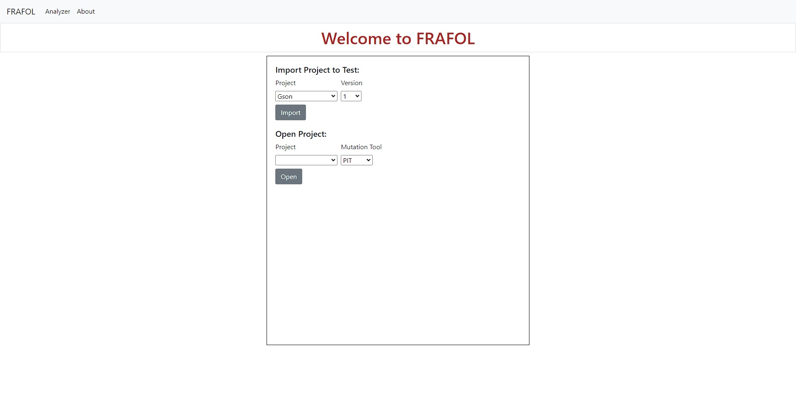
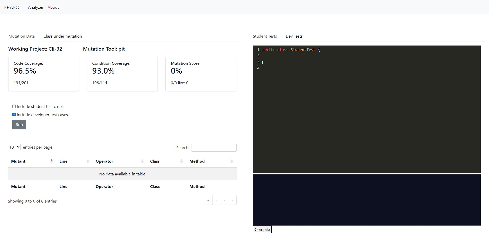

# FRAFOL 

## Description
FRAFOL is an educational framework designed to introduce and teach the concepts and practices of mutation testing. It provides a comprehensive environment where learners can experiment with different mutation testing tools. The framework includes a curated collection of buggy projects provided by Defects4j, offering hands-on experience in identifying and resolving code defects.

## Docker Desktop Installation
In order to use FRAFOL it is required to install Docker in your system. The following guidelines are instructions in the installation of Docker on both Windows, macOS and Linux machines.

### For Windows

1. Check System Requirements 

    - Windows 10 64-bit: Pro, Enterprise, or Education (Build 16299 or later).
    - Hyper-V and Containers Windows features must be enabled.

2. Download Docker Desktop 

    - Visit the [Docker Desktop for Windows download page](https://docs.docker.com/desktop/install/windows-install/) and download the installer.

3. Install Docker Desktop 

    - Run the Docker Desktop Installer executable.
    - Follow the installation wizard steps.
    - When prompted, ensure that the "Enable Hyper-V Windows Features" option is selected.

4. Start Docker Desktop 

    - Once installed, Docker Desktop will start automatically.
    - If not, you can start it from the Start menu.

5. Verify Installation 

    - Open a Command Prompt or PowerShell window.
    - Run the command:
    `docker --version`
    - You should see the Docker version installed.

### For macOS

1. Download Docker Desktop for Mac:

Visit the Docker website: [Docker Desktop for Mac](https://docs.docker.com/desktop/install/mac-install/)
Click on "Download for Mac" to get the Docker Desktop installer.

2. Install Docker Desktop:

Open the downloaded `.dmg` file.
Drag the Docker icon to the Applications folder.

3. Launch Docker Desktop:

Open Docker from the Applications folder.
Follow the on-screen instructions to complete the setup.

4. Verify Installation:

Open a terminal window.
Run the command `docker --version` to ensure Docker is installed and running.

### For Linux (Ubuntu as an example)

1. Update Package Information

```
sudo apt-get update
```

2. Install Prerequisites

```
sudo apt-get install \
ca-certificates \
curl \
gnupg \
lsb-release
```

3. Add Docker’s Official GPG Key

```
sudo mkdir -p /etc/apt/keyrings
curl -fsSL https://download.docker.com/linux/ubuntu/gpg | sudo gpg --dearmor -o /etc/apt/keyrings/docker.gpg
```

4. Set Up the Docker Repository

```
echo \
  "deb [arch=$(dpkg --print-architecture) signed-by=/etc/apt/keyrings/docker.gpg] https://download.docker.com/linux/ubuntu \
  $(lsb_release -cs) stable" | sudo tee /etc/apt/sources.list.d/docker.list > /dev/null
```

5. Install Docker Engine

```
sudo apt-get update
sudo apt-get install docker-ce docker-ce-cli containerd.io docker-buildx-plugin docker-compose-plugin
```

6. Start Docker

    - Start Docker service:
    `sudo systemctl start docker`
    
    - Enable Docker to start on boot:
    `sudo systemctl enable docker`

7. Verify Installation

    - Run the command:
    `docker --version`
    - You should see the Docker version installed.

## FRAFOL Download

### Manual Download
To manually download the project use this [link](https://github.com/PedroTav/Defects4jFlaskApp/archive/refs/heads/master.zip).

Extract the project into a directory of your choice.

### Git Download
To install Github in your system follow the [link](https://github.com/git-guides/install-git) guidelines.

Clone the project into a directory of your choice using the following command: `git clone https://github.com/PedroTav/Defects4jFlaskApp.git`

## FRAFOL Docker Compose
Once Docker has been installed and running, open a terminal in the project directory and run the commmand:
`docker compose up -d`

## Usage
Open a browser page, using the url http://localhost:8000/.



From here, select a project from the dropdown menu, indicating the buggy version for the specific project. Clicking import will add the selection to the list of projects that are currently being tested.

Select a project from the list of imported projects and the mutation tool to be applied. Click open to initiate the chosen project and begin writing test cases.



The following page includes an editor for writing test cases and a dashboard of information regarding mutation testing.

### Navigation Tabs
1. Mutation Data
2. Class under mutation
3. Student Tests
4. Dev Tests

### Tab1: Mutation Data

This tab provides detailed statistics on code coverage, condition coverage, and mutation score for the class.

- **Code Coverage**: Software testing metric that measures the percentage of source code that is executed when a particular set of tests is run. It helps in identifying untested parts of a codebase, ensuring that as much of the code as possible is tested, thereby improving software quality and reliability. Higher code coverage indicates that more lines of code have been tested, which typically leads to fewer undetected bugs.
- **Condition Coverage**: Software testing metric that evaluates whether each boolean sub-expression (condition) in a program has been tested for both true and false outcomes. This ensures that all logical paths are evaluated, helping to identify errors in the decision-making logic of the code.
- **Mutation Score**: Software testing metric that measures the effectiveness of a test suite by introducing small changes (mutations) to the program's code and checking if the tests detect the errors. It is the ratio of mutants killed against mutants that remain alive.

Clicking the **Run** button will execute the mutation tool and run the selected test suites against the alterated code. 

### Tab2: Class under mutation

This tab includes the code regarding the class that is being mutated by the tool.

### Tab3: Student Tests

This tab allows users to write and run their own test cases for the class. Users can input test code, run it, and see the results directly on the page.

### Tab4: Dev Tests

This tab lists all the pre-written tests for the class. Users can review the existing tests to see how the class methods are being tested.

### Live Mutant Data

This page includes a table detailing information about each live mutant present in the code, after executing the mutation tool. This includes:

- **Mutant Id**: An identifier for the specific mutant.
- **Line**: Which line of code the mutant is altering.
- **Operator**: Which type of mutant operator is being applied.
- **Method**: Which class method is being affected by the mutant.

## Contributing
Guidelines for contributing to the project.

## License
Information about the project's license.
